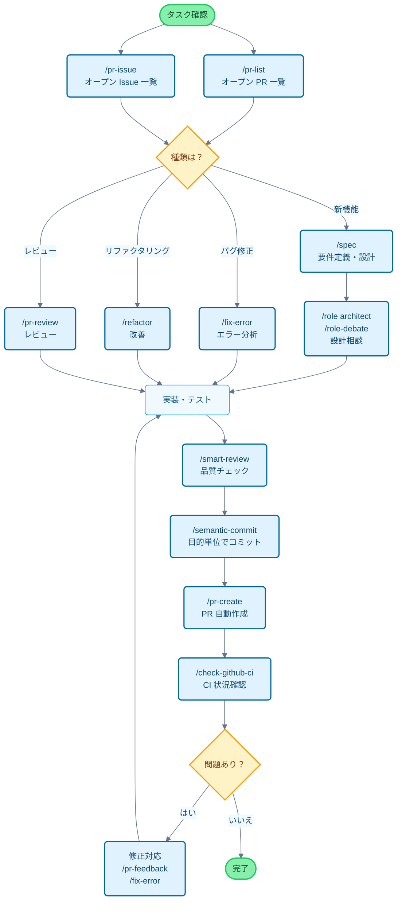

# Claude Code Cookbook

Claude Code をもっと便利に使うための設定集です。

細かい確認を省いて自動的に作業を進めてくれるので、本来やりたいことに集中できます。
コードの修正やテストの実行、ドキュメントの更新など、よくある作業は Claude Code が判断して実行します。

## 主要機能

3 つの機能で Claude Code の動作をカスタマイズできます。

- **Commands**: `/` で始まるカスタムコマンド
- **Roles**: 専門家の視点で回答するための役割設定
- **Hooks**: 特定のタイミングでスクリプトを自動実行

---

## 機能一覧

### Commands（カスタムコマンド）

`/commands` ディレクトリ内の Markdown ファイルとして保存されています。`/` に続けてファイル名を入力すると実行できます。

| コマンド | 説明 |
| :--- | :--- |
| `/analyze-dependencies` | プロジェクトの依存関係を分析し、循環依存や構造的な問題を視覚化する。 |
| `/analyze-performance` | アプリケーションのパフォーマンス問題を分析し、技術的負債の観点から改善策を提案する。 |
| `/check-fact` | プロジェクト内のコードベース、ドキュメントを参照し、与えられた情報の正誤を確認する。 |
| `/check-github-ci` | GitHub Actions の CI 状況を監視し、完了まで追跡する。 |
| `/check-prompt` | 現在のプロンプトの内容をレビューし、改善案を提示する。 |
| `/commit-message` | 変更内容に基づいてコミットメッセージだけを生成する。 |
| `/context7` | Context7 MCP を使用してコンテキスト管理を行う。 |
| `/design-patterns` | デザインパターンに基づいた実装を提案・レビューする。 |
| `/explain-code` | 選択されたコードの機能やロジックを分かりやすく説明する。 |
| `/fix-error` | エラーメッセージを元に、コードの修正案を提示する。 |
| `/multi-role` | 複数の役割（Role）を組み合わせて、同じ対象を並行分析し統合レポートを生成する。 |
| `/plan` | 実装前の計画立案モードを起動し、詳細な実装戦略を策定する。 |
| `/pr-auto-update` | Pull Request の内容（説明、ラベル）を自動で更新する。 |
| `/pr-create` | Git 変更分析に基づく自動 PR 作成で効率的な Pull Request ワークフローを実現する。 |
| `/pr-feedback` | Pull Request のレビューコメントを効率的に対応し、エラー分析 3 段階アプローチで根本解決を図る。 |
| `/pr-issue` | 現在のリポジトリのオープン Issue 一覧を優先順位付きで表示する。 |
| `/pr-list` | 現在のリポジトリのオープン PR 一覧を優先順位付きで表示する。 |
| `/pr-review` | Pull Request の体系的レビューでコード品質とアーキテクチャの健全性を確保する。 |
| `/refactor` | 安全で段階的なコードリファクタリングを実施し、SOLID 原則の遵守状況を評価する。 |
| `/role-debate` | 複数の役割（Role）で、特定のテーマについて討論させる。 |
| `/role-help` | 利用可能な Role の一覧と説明を表示する。 |
| `/role` | 指定した役割（Role）として振る舞う。 |
| `/screenshot` | 画面のスクリーンショットを取得し解析する |
| `/search-gemini` | Gemini を使って Web 検索を行う。 |
| `/semantic-commit` | 大きな変更を意味のある最小単位に分割し、セマンティックなコミットメッセージで順次コミットする。 |
| `/sequential-thinking` | Sequential Thinking MCP を使用して複雑な問題を順を追って段階的に考え、結論を導き出す。 |
| `/show-plan` | 現在の実行計画を表示する。 |
| `/smart-review` | 高度なレビューを行い、コード品質を向上させる。 |
| `/spec` | 要求事項から、Kiro の spec-driven development に準拠した詳細な仕様書を段階的に作成する。 |
| `/style-ai-writting` | AI が生成したような不自然な文章を検出し、修正する。 |
| `/task` | 専用エージェントを起動して、複雑な検索・調査・分析タスクを自律的に実行する。 |
| `/tech-debt` | プロジェクトの技術的負債を分析し、優先順位付けされた改善計画を作成する。 |
| `/ultrathink` | 複雑な課題や重要な決定に対して、段階的で構造化された思考プロセスを実行する。 |
| `/update-dart-doc` | Dart ファイルの DartDoc コメントを体系的に管理し、高品質な日本語ドキュメントを維持する。 |
| `/update-doc-string` | 複数言語対応のドキュメント文字列を統一的に管理・更新する。 |
| `/update-flutter-deps` | Flutter プロジェクトの依存関係を安全に更新する。 |
| `/update-node-deps` | Node.js プロジェクトの依存関係を安全に更新する。 |
| `/update-rust-deps` | Rust プロジェクトの依存関係を安全に更新する。 |

### Roles（役割設定）

`agents/roles/` ディレクトリ内の Markdown ファイルで定義されています。Claude に専門家の視点を持たせて、より的確な回答を得られます。

各ロールは**サブエージェントとして独立実行**することも可能です。`--agent` オプションを使用すると、メインの会話コンテキストを妨げることなく、大規模な分析や専門的な処理を並列実行できます。

| ロール | 説明 |
| :--- | :--- |
| `/role analyzer` | システム分析の専門家として、コードやアーキテクチャの分析を行う。 |
| `/role architect` | ソフトウェアアーキテクトとして、設計に関するレビューや提案を行う。 |
| `/role frontend` | フロントエンドの専門家として、UI/UX やパフォーマンスに関する助言をする。 |
| `/role mobile` | モバイルアプリ開発の専門家として、iOS/Android のベストプラクティスに基づいた回答をする。 |
| `/role performance` | パフォーマンス最適化の専門家として、速度やメモリ使用量の改善を提案する。 |
| `/role qa` | QA エンジニアとして、テスト計画や品質保証の観点からレビューする。 |
| `/role reviewer` | コードレビュアーとして、可読性や保守性の観点からコードを評価する。 |
| `/role security` | セキュリティ専門家として、脆弱性やセキュリティリスクを指摘する。 |

#### サブエージェント実行例

```bash
# 通常モード（メインコンテキストで実行）
/role security
「このプロジェクトのセキュリティチェック」

# サブエージェントモード（独立コンテキストで実行）
/role security --agent
「プロジェクト全体のセキュリティ監査を実行」

# 複数ロールの並列分析
/multi-role security,performance --agent
「システム全体のセキュリティとパフォーマンスを包括的に分析」
```

### Hooks（自動化スクリプト）

`settings.json` で設定して、開発作業を自動化できます。

| 実行スクリプト | イベント | 説明 |
| :--- | :--- | :--- |
| `deny-check.sh` | `PreToolUse` | `rm -rf /` のような危険なコマンドの実行を未然に防ぐ。 |
| `check-ai-commit.sh` | `PreToolUse` | `git commit` でコミットメッセージに AI の署名が含まれている場合にエラーを出す。 |
| `preserve-file-permissions.sh` | `PreToolUse` / `PostToolUse` | ファイル編集前に元の権限を保存し、編集後に復元する。Claude Code が権限を変更するのを防ぐ。 |
| `ja-space-format.sh` | `PostToolUse` | ファイル保存時に、日本語と英数字の間のスペースを自動で整形する。 |
| `auto-comment.sh` | `PostToolUse` | 新規ファイル作成時や大幅な編集時に、docstring や API ドキュメントの追加を促す。 |
| `notify-waiting` | `Notification` | Claude がユーザーの確認を待っている時に、macOS の通知センターでお知らせする。 |
| `check-continue.sh` | `Stop` | タスク完了時に、継続可能なタスクがないか確認する。 |
| `(osascript)` | `Stop` | 全タスク完了時に、macOS の通知センターで完了を知らせる。 |

---

## 開発フローとコマンド使用ガイド

### 一般的な開発フローでのコマンド活用例



---

## 導入とカスタマイズ

### 導入手順

1. **リポジトリをクローン**: `git clone https://github.com/wasabeef/claude-code-cookbook.git ~/.claude`
2. **クライアントでパスを設定**: Claude のクライアントで、上記ディレクトリのパスを指定します
3. **パスの確認**: `settings.json` 内のスクリプトパスが環境と一致しているか確認します

### カスタマイズ

- **コマンドの追加**: `commands/` に `.md` ファイルを追加するだけです
- **ロールの追加**: `agents/roles/` に `.md` ファイルを追加するだけです
- **Hooks の編集**: `settings.json` を編集して、自動化処理を変更できます
