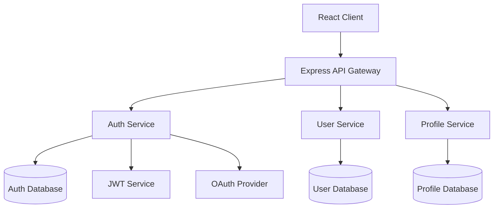

## Spec

**「コードを書く前に構造を与える」** - Kiro の spec-driven development に完全準拠

従来のコード生成ツールとは異なり、開発の混沌に構造を与えることに重点を置いた Kiro の仕様駆動開発を実現。わずかな要件入力から、プロダクトマネージャーレベルの詳細な仕様と実装可能な設計まで段階的に展開し、**プロトタイプから本番環境**まで一貫した品質を保証します。

### 使い方

```bash
# Claude に Spec Mode を依頼（最小限の要件入力）
「[機能説明] の spec を作成して」

# Kiro 式段階的展開:
# 1. 簡単な要件 → 詳細なユーザーストーリー自動生成
# 2. EARS 記法による構造化された要件記述
# 3. 段階的対話を通じた仕様の精緻化
# 4. 3 つの独立したファイルを生成:
#    - requirements.md: EARS 記法による要件定義
#    - design.md: Mermaid 図・ TypeScript インターフェース含む設計
#    - tasks.md: ベストプラクティス自動適用の実装計画
```

### 実証された効果（Kiro 実績）

**2 日間でセキュアファイル共有アプリ**

```bash
「ファイル共有システム（暗号化対応）の spec を作成して」
→ 2 日間で本番レベルの暗号化ファイル共有アプリケーション完成
→ セキュリティベストプラクティス自動適用
→ 追加プロンプト不要
```

**1 晩でゲーム開発（未経験者）**

```bash
「2D パズルゲームの spec を作成して」
→ ゲーム開発未経験のオープンソース開発者
→ 1 晩でゲーム作成完了
→ 実装ロジックは Kiro が処理、開発者は創造性に集中
```

**週末でプロトタイプ→本番**

```bash
「EC サイトの商品管理システムの spec を作成して」
→ 1 週末でコンセプトから動作するプロトタイプまで
→ プロトタイプから本番環境への一貫した品質
→ spec-driven development による構造化アプローチ
```

### 基本例

```bash
# 新機能の spec 作成（最小限入力）
「商品レビューシステム
- 星評価機能
- コメント投稿
- 画像アップロード」

# システム機能の spec 作成
「ユーザー認証
- OAuth 対応
- 多要素認証」

# API 機能の spec 作成
「決済システム API
- Stripe 連携
- セキュリティ重視」
```

### Claude との連携

```bash
# 複雑な機能 spec
「チャット機能の spec を作成して。WebSocket、リアルタイム通知、履歴管理を含めて」

# データベース連携機能 spec
「EC サイトの在庫管理機能の spec を作成して。商品追加、在庫更新、アラート機能を含めて」

# フロントエンド機能 spec
「React ダッシュボードの spec を作成して。グラフ表示、フィルター、エクスポート機能を含めて」

# バックエンド機能 spec
「RESTful API の spec を作成して。認証、バリデーション、ログ記録を含めて」
```

### Spec Mode の特徴

**段階的対話ワークフロー**

- Kiro の本来の価値である段階的議論を完全再現
- 各フェーズでユーザーと協力的に仕様を洗練
- 疑問点の解消、選択肢の議論、承認プロセスを経てファイル生成

**3 段階の対話的展開**

- **Phase 1**: Requirements Discovery → 議論 → 承認 → `requirements.md` 生成
- **Phase 2**: Design Exploration → 議論 → 承認 → `design.md` 生成
- **Phase 3**: Implementation Planning → 議論 → 承認 → `tasks.md` 生成

**動的な仕様策定**

- 要件の曖昧さを対話で解消
- 技術選択肢の提示と議論
- トレードオフの説明と判断確認

### 詳細例

```bash
# 複雑なシステム機能
「オンライン決済システムの spec を作成して。Stripe 連携、セキュリティ、エラーハンドリングを含めて」

# フロントエンド機能
「React コンポーネントの spec を作成して。状態管理、プロパティ設計、テストを含めて」

# バックエンド機能
「GraphQL API の spec を作成して。スキーマ設計、リゾルバー、認証を含めて」

# DevOps 機能
「CI/CD パイプラインの spec を作成して。テスト自動化、デプロイメント、監視を含めて」
```

### 段階的対話ワークフロー（Phase by Phase）

#### Phase 1: Requirements Discovery & Discussion

**1. 最小限入力からの自動拡張（Kiro 式）**

```
ユーザー: 「ユーザー管理システム
- ログイン機能
- プロフィール編集
- 管理者権限」

Claude: 「要件から詳細なユーザーストーリーを生成します。
この理解で正しいですか？

自動生成されたユーザーストーリー:
- ユーザー登録・認証機能（OAuth 対応）
- プロフィール管理機能（アバター、設定）
- 権限管理機能（RBAC）
- パスワードリセット機能
- セキュリティ監査ログ

明示されていない詳細を補完しました。他に必要な機能はありますか？」
```

**2. EARS 記法による構造化要件記述**

```
Claude: 「Kiro の EARS 記法で要件を構造化します：

EARS 記法による要件定義:

WHEN ユーザーがログインを試行する際
GIVEN 正しいメールアドレスとパスワードを入力した場合
THEN システムは認証を確認する
AND 成功時はダッシュボードにリダイレクトする

WHILE ユーザーがプロフィール編集画面にいる間
THE SYSTEM SHALL リアルタイムでバリデーションを実行する
AND 変更内容をプレビュー表示する

WHERE 管理者権限が必要な機能に
IS アクセスが試行された場合
THE SYSTEM SHALL 権限レベルを確認する
AND 不十分な場合はアクセス拒否する」
```

**3. エッジケース・セキュリティ要件の自動補完**

```
Claude: 「Kiro のベストプラクティスに基づき、以下のケースも考慮しました：

セキュリティ要件（自動補完）:
- ブルートフォース攻撃対策
- セッション管理とタイムアウト
- CSRF 保護と XSS 対策
- パスワード強度要件

エッジケース（自動検出）:
- 同時ログイン制限
- アカウントロック機能
- データ移行時の整合性確保
- 大量リクエスト時の負荷分散

これらの要件は適切ですか？」
```

**5. Phase 1 完了と承認**

```
Claude: 「Requirements Phase が完了しました。
requirements.md を生成してよろしいですか？」
→ 「次に進んで」→ requirements.md 生成
```

#### Phase 2: Design Exploration & Discussion

**1. コードベース分析 + 自動設計提案（Kiro 式）**

```
Claude: 「既存コードベースを分析し、最適なアーキテクチャを提案します：

コードベース分析結果:
- 認証: JWT + Express.js（v4.18.x）
- データベース: PostgreSQL（v14+）
- フロントエンド: React + TypeScript（v18+）
- 既存パターン: Repository パターン、Service 層分離

Kiro 推奨アーキテクチャ:
- Clean Architecture 準拠
- Domain-Driven Design 要素
- CQRS パターンの部分的適用
- 自動化されたセキュリティベストプラクティス

この設計で進めますか？」
```

**2. Mermaid 図による視覚的設計**

```
Claude: 「システム設計を Mermaid 図で自動生成しました：

自動生成されたアーキテクチャ図:



データフロー図も生成しますか？」

```

**3. TypeScript インターフェース自動生成**
```

Claude: 「設計に基づいて TypeScript インターフェースを自動生成します：

自動生成 TypeScript インターフェース:

```typescript
// Domain entities
interface User {
  readonly id: UserId;
  readonly email: Email;
  readonly profile: UserProfile;
  readonly auth: AuthSettings;
  readonly permissions: Permission[];
  readonly createdAt: Date;
  readonly updatedAt: Date;
}

interface UserProfile {
  readonly displayName: string;
  readonly avatar: AvatarUrl;
  readonly preferences: UserPreferences;
}

interface AuthSettings {
  readonly passwordHash: PasswordHash;
  readonly mfaEnabled: boolean;
  readonly lastLoginAt: Date;
  readonly failedAttempts: number;
}

// Use cases
interface UserRepository {
  findById(id: UserId): Promise<User | null>;
  findByEmail(email: Email): Promise<User | null>;
  save(user: User): Promise<void>;
}

interface AuthenticationService {
  authenticate(credentials: LoginCredentials): Promise<AuthResult>;
  refreshToken(token: RefreshToken): Promise<AccessToken>;
}
```

このインターフェース設計で進めますか？」

```

**4. Phase 2 完了と承認**
```

Claude: 「Design Phase が完了しました。
design.md を生成してよろしいですか？」
→ 「次に進んで」→ design.md 生成

```

#### Phase 3: Implementation Planning & Discussion

**1. ベストプラクティス自動適用（Kiro 式）**
```

Claude: 「Kiro のベストプラクティスを自動適用した実装計画を生成しました：

自動生成された実装戦略:

1. セキュリティファースト開発
   - OWASP Top 10 対策の自動組み込み
   - 暗号化・ハッシュ化の自動実装
   - セキュリティテストの自動生成

2. クリーンアーキテクチャの強制
   - レイヤー分離の自動実装
   - 依存性逆転の自動適用
   - テスタブルな設計の強制

3. パフォーマンス最適化
   - キャッシュ戦略の自動実装
   - データベース最適化
   - 非同期処理の活用

このアプローチで進めますか？」

```

**2. 品質チェックポイント自動設定**
```

Claude: 「各実装段階での品質チェックポイントを自動設定しました：

自動品質保証プロセス:

Phase 3a: バックエンド実装

- [ ] セキュリティスキャン（SAST/DAST）
- [ ] API 仕様テスト（OpenAPI 準拠）
- [ ] パフォーマンステスト（負荷・レスポンス）
- [ ] 脆弱性スキャン（依存関係・ CVE）

Phase 3b: フロントエンド実装

- [ ] アクセシビリティテスト（WCAG 2.1 AA）
- [ ] ブラウザ互換性テスト
- [ ] レスポンシブデザイン検証
- [ ] セキュリティヘッダー確認

Phase 3c: 統合・デプロイ

- [ ] E2E テストスイート
- [ ] CI/CD パイプライン設定
- [ ] モニタリング・ログ設定
- [ ] 本番環境セキュリティ監査

すべて自動実行されます。追加の品質基準はありますか？」

```

**3. 依存関係とリスク軽減の自動分析**
```

Claude: 「実装順序とリスク軽減策を自動分析しました：

最適化された実装順序:

Week 1: インフラ・セキュリティ基盤

- データベース設計・スキーマ作成
- 認証基盤（JWT + セッション管理）
- セキュリティミドルウェア実装
- 基本的な API エンドポイント

Week 2: コア機能実装

- ユーザー管理機能
- プロフィール管理機能
- 権限管理システム
- バリデーション・エラーハンドリング

Week 3: 高度な機能・最適化

- 多要素認証実装
- 監査ログ機能
- パフォーマンス最適化
- フロントエンド統合

自動検出されたリスク軽減策:

- 多要素認証: 段階的導入（SMS→アプリ認証）
- セッション管理: Redis クラスター構成
- 大量アクセス: レート制限 + CDN 活用
- データ整合性: トランザクション管理強化

この計画で問題ありませんか？」

```

**4. Phase 3 完了と承認**
```

Claude: 「Implementation Planning Phase が完了しました。
tasks.md を生成してよろしいですか？」
→ 「次に進んで」→ tasks.md 生成

```

### Kiro 特有の機能

**EARS 記法 (Easy Approach to Requirements Syntax)**
```markdown
# Kiro 標準の EARS 記法パターン

WHEN [状況・トリガー]
GIVEN [前提条件]
THEN [システムの動作]
AND [追加の動作]

WHILE [状態・プロセス]
THE SYSTEM SHALL [必須動作]
AND [関連動作]

WHERE [機能・コンポーネント]
IS [条件・状態]
THE SYSTEM SHALL [対応動作]
```

**自動生成機能**

- **Mermaid 図**: アーキテクチャ・データフロー図の自動生成
- **TypeScript インターフェース**: 設計に基づく型定義自動作成
- **ベストプラクティス**: セキュリティ・パフォーマンス対策の自動組み込み
- **品質チェックポイント**: 段階別品質基準の自動設定

**hooks 連携**

- ファイル保存時の自動品質チェック
- コード標準の自動適用
- セキュリティスキャンの自動実行
- OWASP Top 10 対策の自動検証

**プロトタイプ→本番品質保証**

- 構造化アプローチによる一貫した設計
- セキュリティファースト開発の強制
- スケーラブルアーキテクチャの自動適用
- 継続的品質管理の組み込み

### 注意事項

**適用範囲**

- Spec Mode は機能実装に最適化
- 単純な修正や小規模な変更の場合は通常の実装形式を使用
- 新規機能開発や複雑な機能改修に推奨

**品質保証**

- 各段階での完了基準を明確化
- 実装前の設計レビュー
- テストとアクセシビリティを含む包括的な品質基準

**実行上の注意**

- 要件の曖昧さを解消してから設計段階へ
- 設計完了後に実装タスクを生成
- 各段階での承認プロセスを重視

### トリガーフレーズとコントロール

#### 段階的ワークフロー制御

**開始トリガー**

- 「[機能名] の spec を作成して」
- 「spec 駆動で [機能名] を開発したい」
- 「仕様書から [機能名] を設計して」

**フェーズ進行制御**

- **「次に進んで」**: 現在のフェーズを完了してファイル生成、次フェーズへ
- **「修正して」**: 現在のフェーズ内で内容を調整・改善
- **「やり直して」**: 現在のフェーズを最初からやり直し
- **「詳しく説明して」**: より詳細な説明や選択肢を提示
- **「スキップして」**: 現フェーズをスキップして次へ（非推奨）

**ファイル生成タイミング**

```
Phase 1 完了 → 「次に進んで」 → requirements.md 生成
Phase 2 完了 → 「次に進んで」 → design.md 生成
Phase 3 完了 → 「次に進んで」 → tasks.md 生成
```

### 実行例（段階的フロー）

```bash
# 使用例
ユーザー: 「ユーザー管理システムの spec を作成して」

# Phase 1: Requirements Discovery
Claude: [要件の確認と議論開始]
ユーザー: [応答・議論・修正]
Claude: 「Requirements Phase が完了しました。次に進んでよろしいですか？」
ユーザー: 「次に進んで」
→ requirements.md 生成

# Phase 2: Design Exploration
Claude: [設計の提案と議論開始]
ユーザー: [技術選択・アーキテクチャ議論]
Claude: 「Design Phase が完了しました。次に進んでよろしいですか？」
ユーザー: 「次に進んで」
→ design.md 生成

# Phase 3: Implementation Planning
Claude: [実装計画の議論開始]
ユーザー: [優先度・リスク・工数の議論]
Claude: 「Implementation Phase が完了しました。次に進んでよろしいですか？」
ユーザー: 「次に進んで」
→ tasks.md 生成

# 完了
Claude: 「spec 駆動開発の準備が完了しました。実装を開始できます。」
```

### /plan との違い

| 特徴 | /plan | /spec |
|------|-------|-------|
| 対象 | 一般的な実装計画 | 機能仕様駆動開発 |
| 出力形式 | 単一の計画ドキュメント | 3 つの独立したファイル（requirements.md、design.md、tasks.md） |
| 要件定義 | 基本的な要件整理 | EARS 記法による詳細な受け入れ基準 |
| 設計 | 技術選定中心 | コードベース分析ベース |
| 実装 | 一般的なタスク分解 | 依存関係を考慮したシーケンス |
| 品質保証 | 基本的なテスト戦略 | 包括的な品質要件（テスト、アクセシビリティ、パフォーマンス） |
| 同期 | 静的な計画 | 動的な spec 更新 |

### 推奨ユースケース

**spec 使用推奨**

- 新機能開発
- 複雑な機能改修
- API 設計
- データベース設計
- UI/UX 実装

**plan 使用推奨**

- システム全体の設計
- インフラ構築
- リファクタリング
- 技術選定
- アーキテクチャ変更
